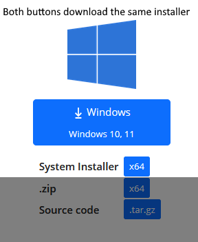
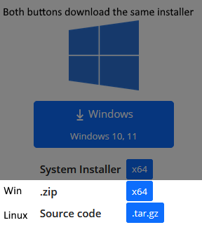

# Doxygen

Doxygen looks through the directories and subdirectories it is pointed at and generates documentation files in a location. For our project this is set to `root/include root/src` and `root/doxydocs` respectively.

## Installing Doxygen

If don't have Doxygen installed, you'll need it do generate documentation. Click this [link](https://www.doxygen.nl/download.html) to go to the website and download either the installer (easier) or the binaries.

### Method 1: Installer
Follow the installer, accept license agreement and make sure all components are checked before you click next.

### Method 2: Binaries

**Buttons**

Unzip the binary files and put the directory in a place where you will find them. Copy the absolute path and add that location to your `PATH`. You can do this by:

1. Going to System Properties and clicking Environment Variables
2. In Environment Variables, select `Path` and click `Edit`.
3. Inside Edit environment variable, click `New` and paste the full path to your binaries.
4. Hit ok.

### Verify doxygen is installed

To verify, open the terminal and type `doxygen --version`. You should get a printout with the version number.

## Generating documentation with doxygen

To generate Doxygen documentation, ensure the Doxyfile is present in the project root, open the terminal and run the command:

>`doxygen`

This will generate html inside `doxydocs/html`. You can browse the documentation by opening `doxydocs/html/index.html` in a browser.

The Doxyfile is configured to look in `src` and `include` for code/documentation. To change the location, change the value on the right side of `INPUT                  = src include` inside the file.

> [!WARNING]
> This changes the settings for EVERYONE. Ask people before you change anything.

## Regenerating documentation

There's no *Clean and rebuild* option for Doxygen, so it is best if we between generations delete the `doxydocs` directory, then run `doxygen` from the root folder again.

## Generating Doxyfile

If the Doxyfile at any point needs to be replaced, delete the Doxyfile file and run from the repo root:

`doxygen -g <name>` where `<name>` is the desired name of the config file. If no name is provided, Doxyfile will be thee default.

Ideally we should avoid generating our own Doxyfile to ensure everyone has one shared file.

